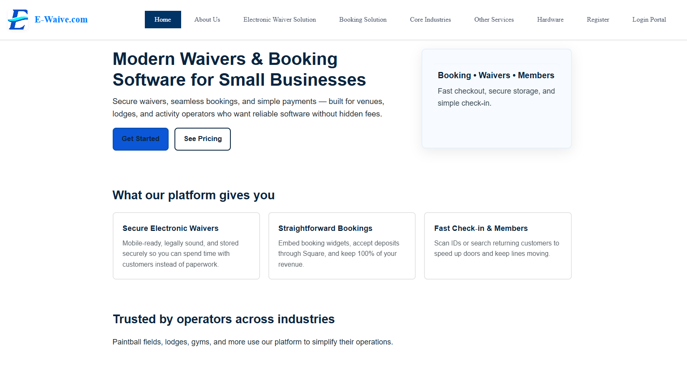
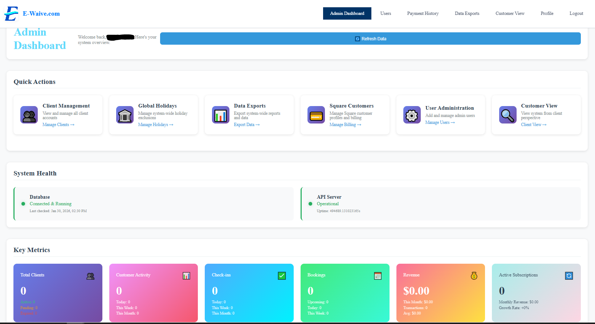
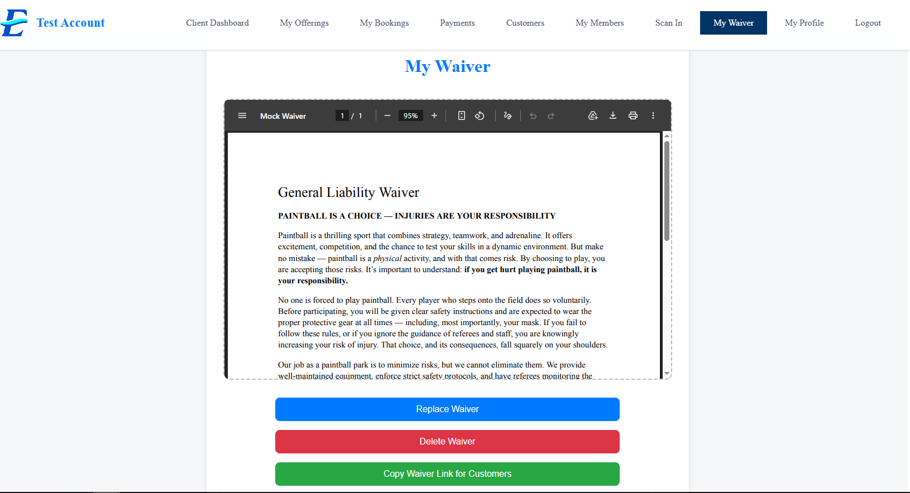

# E-Waive - Electronic Waiver Management System

**Live Site:** [e-waive.com](https://e-waive.com)  
**Role:** Solo Developer (Contract Project)  
**Timeline:** 5 months

## Overview
Full-stack SaaS application for digital waiver collection and management, handling real users and legal document workflows. Built from concept to production deployment, managing the entire technical lifecycle for a US-based client.

## Technical Stack

**Frontend:**
- React with responsive design
- Hosted on AWS Amplify with SSL certificate
- Real-time form validation and user feedback

**Backend:**
- Node.js/Express REST API
- AWS Elastic Beanstalk deployment
- Load balancing for high availability and scalability

**Database:**
- SQL (AWS RDS)
- Normalized schema design for efficient queries
- Secure user authentication and encrypted data storage

**Integrations:**
- Square payment processing for subscription billing
- Automated email notifications for waiver completion
- PDF document generation and secure storage
- JWT-based authentication system

## Key Features
- User authentication and role-based authorization (admin/business/customer tiers)
- Digital waiver creation with customizable fields and branding
- Real-time waiver signing with legal compliance tracking
- Payment processing and subscription management via Square API
- Admin dashboard for waiver analytics and user management
- Automated email workflows for waiver reminders and confirmations
- Mobile-responsive design for on-site waiver collection

## Architecture Highlights
- Multi-tier AWS infrastructure with automated scaling
- Load-balanced backend ensuring 99.9% uptime
- Secure payment integration meeting PCI compliance standards
- Database schema optimized for fast retrieval and reporting
- JWT token-based stateless authentication
- Automated backup and disaster recovery systems

## Challenges Solved

### JWT Authentication Implementation
- Designed and implemented secure JWT token system for stateless authentication across distributed infrastructure
- Handled token refresh flows, expiration management, and secure storage
- Integrated role-based access control (RBAC) with token claims
- Prevented common security vulnerabilities (token hijacking, XSS attacks)

### AWS Infrastructure Configuration
- Architected complete AWS deployment from scratch across multiple services (Amplify, Elastic Beanstalk, RDS)
- Configured load balancing and auto-scaling to handle traffic spikes
- Set up security groups, VPCs, and IAM roles following AWS best practices
- Managed SSL certificate provisioning and DNS configuration
- Debugged cross-service communication issues and latency optimization

### Database Design and Optimization
- Learned the critical importance of consistent naming conventions across tables, columns, and relationships
- Designed normalized schema to prevent data redundancy while maintaining query performance
- Implemented efficient indexing strategies for common query patterns
- Handled migrations and schema updates without downtime
- Optimized complex JOIN queries for admin analytics dashboard

### Automation and Developer Productivity
- Built custom scripts to automate repetitive deployment tasks
- Created database seeding scripts for testing and development environments
- Developed automated backup verification and restoration procedures
- Implemented Git hooks for pre-deployment validation
- Scripted environment variable management across dev/staging/production

## Deployment
- Automated CI/CD pipeline with GitHub integration
- Multi-environment setup (development, staging, production)
- Zero-downtime deployment strategy
- Production environment monitoring with CloudWatch
- SSL/TLS encryption throughout the entire stack
- Automated health checks and rollback capabilities

## Key Learnings
This project taught me the importance of:
- Proper database naming conventions that scale as projects grow
- Infrastructure-as-code thinking when working with cloud services
- Writing automation scripts early to save massive amounts of time later
- Security-first design, especially around authentication and payment handling
- The value of load testing before production launch

---

*Note: Source code is private (client project). This showcase demonstrates the architecture and technical capabilities developed during this engagement.*

### Application Screenshots

**Homepage**  

**Admin Dashboard**  

**Waiver Signing Flow**  

